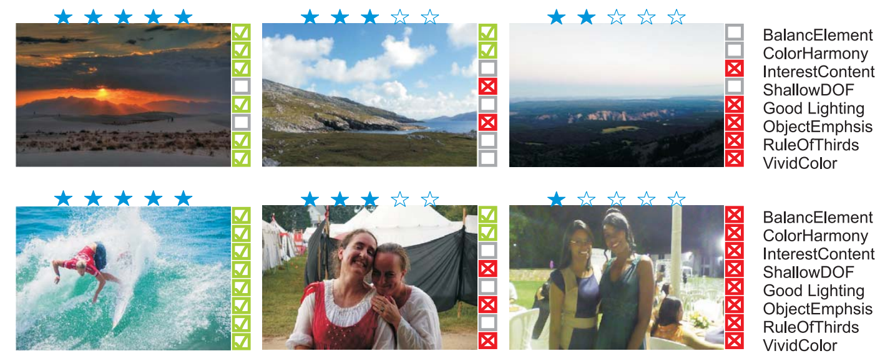

# deep-aesthetics-pytorch
PyTorch implementation of ["Photo Aesthetics Ranking Network with Attributes and Content Adaptation" by Kong et al. (ECCV 2016)](https://arxiv.org/abs/1606.01621)

<p align="center"></p>


### Dataset

Download the [AADB](https://www.ics.uci.edu/~skong2/aesthetics.html) dataset. 
```bash
bash scripts/download_aadb.sh
```

### Install Dependencies
```bash
pip install -r requirements.txt
```
